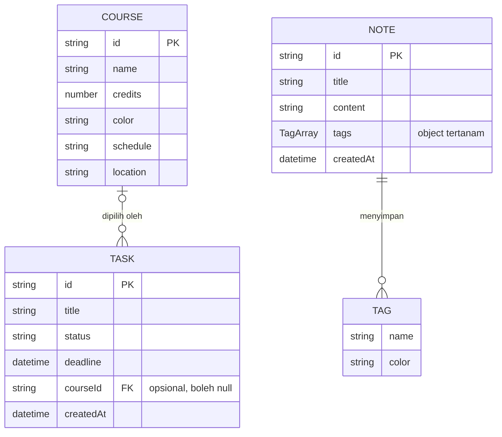
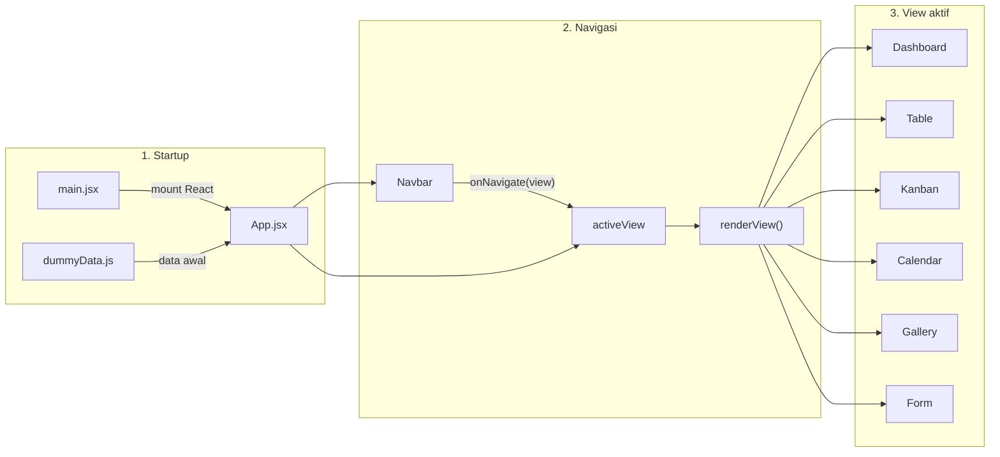
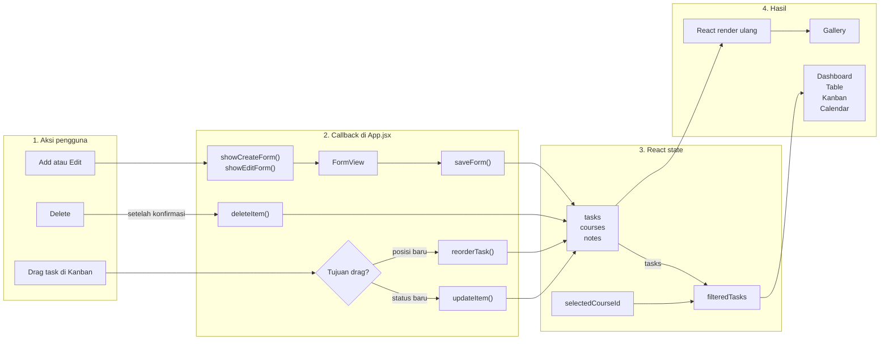

# Arsitektur Mini Notion

Dokumen ini menjelaskan bentuk data dan alur aplikasi Mini Notion saat ini. Diagram dibuat untuk membantu membaca kode, bukan sebagai rancangan database yang harus diimplementasikan.

## ERD: Relasi Data

Versi yang dapat diedit tersedia dalam format [`mini-notion.dbml`](mini-notion.dbml). Untuk membukanya di DB Diagram:

1. Buka [dbdiagram.io](https://dbdiagram.io).
2. Buat diagram baru.
3. Salin isi `mini-notion.dbml` ke editor atau gunakan menu **Import DBML**.

File DBML menggunakan bentuk tabel relasional agar relasi mudah divisualisasikan. Bentuk ini tetap konseptual karena aplikasi saat ini menyimpan data sebagai object dan array di React state.

### Preview ERD



### Cara membaca ERD

- Satu `Course` dapat memiliki nol atau banyak `Task`.
- Satu `Task` dapat terhubung ke nol atau satu `Course` melalui `courseId`. Nilai `null` berarti task tidak terikat ke mata kuliah mana pun.
- Saat sebuah course dihapus, task yang sebelumnya terhubung tidak ikut dihapus. Aplikasi mengubah `courseId` task tersebut menjadi `null`.
- Satu `Note` dapat menyimpan nol atau banyak `Tag`.
- `Tag` ditampilkan sebagai entity konseptual agar strukturnya mudah dipahami. Di dalam kode, tag bukan collection state terpisah, tetapi object `{ name, color }` di dalam array `note.tags`.

## Flow Aplikasi

Versi editable tersedia di [`mini-notion-flow.excalidraw`](mini-notion-flow.excalidraw). Buka [excalidraw.com](https://excalidraw.com), pilih **Open**, lalu pilih file tersebut.

Untuk Mermaid Live Editor, salin hanya isi di dalam blok diagram tanpa baris pembuka dan penutup tiga backtick.

### 1. Startup, navigasi, dan pemilihan view



### 2. Aksi pengguna dan perubahan data



### Cara membaca flow

1. `main.jsx` memasang komponen `App` ke halaman.
2. `App.jsx` membuat state awal dari data di `dummyData.js`. State utama terdiri dari `tasks`, `courses`, `notes`, view aktif, filter course, dan kondisi form.
3. Navbar mengubah `activeView`. Fungsi `renderView()` kemudian memilih view yang ditampilkan.
4. Data dikirim dari `App` ke view melalui props. View tidak menyimpan collection utama sendiri.
5. Saat pengguna menambah, mengedit, menghapus, atau memindahkan task, view memanggil callback dari `App`.
6. Callback memperbarui state React. Perubahan state memicu render ulang sehingga view menampilkan data terbaru.
7. Dropdown filter mata kuliah mengubah `selectedCourseId`. Jika nilainya berisi ID course, `filteredTasks` hanya memuat task milik course tersebut; nilai kosong menampilkan semua task. Hasil filter yang sama dikirim ke Dasbor, Tabel Tugas, Kanban, dan Kalender.

## Penyimpanan Data

Mini Notion belum memakai database, API, atau `localStorage`. Semua perubahan hanya hidup di React state selama tab aplikasi masih terbuka.

Saat halaman dimuat ulang:

1. React state dibuat ulang.
2. `initialTasks`, `initialCourses`, dan `initialNotes` dari `dummyData.js` dipakai kembali.
3. Data yang ditambah, diedit, dihapus, atau diurutkan selama sesi sebelumnya akan hilang.

Alur singkatnya adalah:

```text
dummyData.js -> React state di App.jsx -> props ke view -> callback ke App.jsx -> state baru -> render ulang
```
